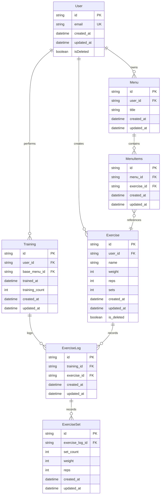

# ER図

## テーブル一覧

| テーブル名 | 概要 |
|-----------|------|
| User | アプリケーションの利用者 |
| Exercise | トレーニング種目のマスタデータ |
| Menu | トレーニングメニューのテンプレート |
| MenuItems | メニューと種目の中間テーブル |
| Training | トレーニング記録 |
| ExerciseLog | トレーニング記録内の種目記録 |
| ExerciseSet | 種目記録内のセット記録 |

## ER図

## テーブル詳細

### User

| カラム名 | 型 | 制約 | 説明 |
|---------|-----|------|------|
| id | string | PK | ユーザーID |
| email | string | UK | メールアドレス |
| created_at | datetime | NOT NULL | 作成日時 |
| updated_at | datetime | NOT NULL | 更新日時 |
| isDeleted | boolean | NOT NULL | 論理削除フラグ |

### Exercise

| カラム名 | 型 | 制約 | 説明 |
|---------|-----|------|------|
| id | string | PK | 種目ID |
| user_id | string | FK → User.id | 所有ユーザー |
| name | string | NOT NULL | 種目名 |
| weight | int | NOT NULL | 重量 |
| reps | int | NOT NULL | 回数 |
| sets | int | NOT NULL | セット数 |
| created_at | datetime | NOT NULL | 作成日時 |
| updated_at | datetime | NOT NULL | 更新日時 |
| is_deleted | boolean | NOT NULL | 論理削除フラグ |

### Menu

| カラム名 | 型 | 制約 | 説明 |
|---------|-----|------|------|
| id | string | PK | メニューID |
| user_id | string | FK → User.id | 所有ユーザー |
| title | string | NOT NULL | メニュータイトル |
| created_at | datetime | NOT NULL | 作成日時 |
| updated_at | datetime | NOT NULL | 更新日時 |

### MenuItems

| カラム名 | 型 | 制約 | 説明 |
|---------|-----|------|------|
| id | string | PK | メニュー種目ID |
| menu_id | string | FK → Menu.id | 所属メニュー |
| exercise_id | string | FK → Exercise.id | 参照する種目 |
| created_at | datetime | NOT NULL | 作成日時 |
| updated_at | datetime | NOT NULL | 更新日時 |

### Training

| カラム名 | 型 | 制約 | 説明 |
|---------|-----|------|------|
| id | string | PK | トレーニング記録ID |
| user_id | string | FK → User.id | 実施ユーザー |
| base_menu_id | string | FK → Menu.id | ベースにしたメニュー |
| trained_at | datetime | NOT NULL | トレーニング日時 |
| training_count | int | NOT NULL | 通算トレーニング回数 |
| created_at | datetime | NOT NULL | 作成日時 |
| updated_at | datetime | NOT NULL | 更新日時 |

### ExerciseLog

| カラム名 | 型 | 制約 | 説明 |
|---------|-----|------|------|
| id | string | PK | 種目記録ID |
| training_id | string | FK → Training.id | 所属トレーニング記録 |
| exercise_id | string | FK → Exercise.id | 参照する種目 |
| created_at | datetime | NOT NULL | 作成日時 |
| updated_at | datetime | NOT NULL | 更新日時 |

### ExerciseSet

| カラム名 | 型 | 制約 | 説明 |
|---------|-----|------|------|
| id | string | PK | セット記録ID |
| exercise_log_id | string | FK → ExerciseLog.id | 所属する種目記録 |
| set_count | int | NOT NULL | セット番号（1から連番） |
| weight | int | NOT NULL | 重量 |
| reps | int | NOT NULL | 回数 |
| created_at | datetime | NOT NULL | 作成日時 |
| updated_at | datetime | NOT NULL | 更新日時 |

## リレーション

| 親テーブル | 子テーブル | 関係 | 説明 |
|-----------|-----------|------|------|
| User | Exercise | 1 : N | ユーザーが種目を作成 |
| User | Menu | 1 : N | ユーザーがメニューを所有 |
| User | Training | 1 : N | ユーザーがトレーニングを実施 |
| Menu | MenuItems | 1 : N | メニューが種目を含む |
| Exercise | MenuItems | 1 : N | 種目がメニューから参照される |
| Training | ExerciseLog | 1 : N | トレーニング記録が種目記録を持つ |
| Exercise | ExerciseLog | 1 : N | 種目が種目記録で参照される |
| ExerciseLog | ExerciseSet | 1 : N | 種目記録がセット記録を持つ |
